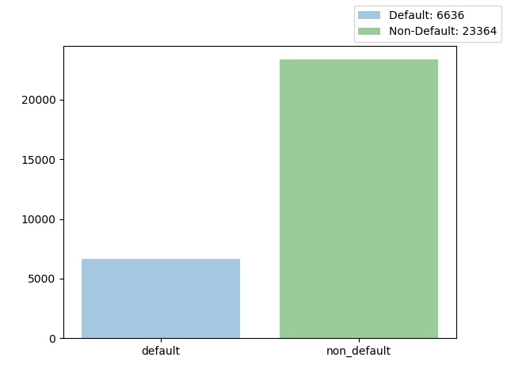

  Adrian Sandoval-Vargas

 CSI 5810 Credit Card Default

<h1></h1>

## Data Processing

</img>

### Standard Metric 1 = male; 2 = female

|SEX|COUNT |
|---|---|
|2|18112|
|1|11888|

### 1 = grad, 2 = under grad, 3 = high school, 4 = others

What about 5,6,0?

|EDUCATION|COUNT |
|---|---|
|2|14030|
|1|10585|
|3|4917|
|5|280|
|4|123|
|6|51|
|0|14|

### Standard Metric

|AGE|COUNT |
|---|---|
|29|1605|
|27|1477|
|28|1409|
|30|1395|
|26|1256|
|31|1217|
|25|1186|
|34|1162|
|32|1158|
|33|1146|
|24|1127|
|35|1113|
|36|1108|
|37|1041|
|39|954|
|38|944|
|23|931|
|40|870|
|41|824|
|42|794|
|44|700|
|43|670|
|45|617|
|46|570|
|22|560|
|47|501|
|48|466|
|49|452|
|50|411|
|51|340|
|53|325|
|52|304|
|54|247|
|55|209|
|56|178|
|58|122|
|57|122|
|59|83|
|21|67|
|60|67|
|61|56|
|62|44|
|63|31|
|64|31|
|66|25|
|65|24|
|67|16|
|69|15|
|70|10|
|68|5|
|73|4|
|72|3|
|75|3|
|71|3|
|74|1|
|79|1|

### 1 = married; 2 = single; 3 = other what about 0?

|MARRIAGE|COUNT |
|---|---|
|2|15964|
|1|13659|
|3|323|
|0|54|

### why -2, 0, 

|PAY_0|COUNT|PAY_2|COUNT|PAY_3|COUNT |PAY_4|COUNT|PAY_5|COUNT |PAY_6|COUNT |
|---|---|---|---|---|---|---|---|---|---|---|---|
|0|14737|0|15730|0|15764|0|16455|0|16947|0|16286|
|-1|5686|-1|6050|-1|5938|-1|5687|-1|5539|-1|5740|
|1|3688|1|28|1|4|1|2||
|-2|2759|-2|3782|-2|4085|-2|4348|-2|4546|-2|4895|
|2|2667|2|3927|2|3819|2|3159|2|2626|2|2766|
|3|322|3|326|3|240|3|180|3|178|3|184|
|4|76|4|99|4|76|4|69|4|84|4|49|
|5|26|5|25|5|21|5|35|5|17|5|13|
|8|19|8|1|8|3||8|3|8|2|8|1|8|2|
|6|11|6|12|6|23|6|5|6|4|6|19|
|7|9|7|20|7|27|7|58|7|58|7|46|

